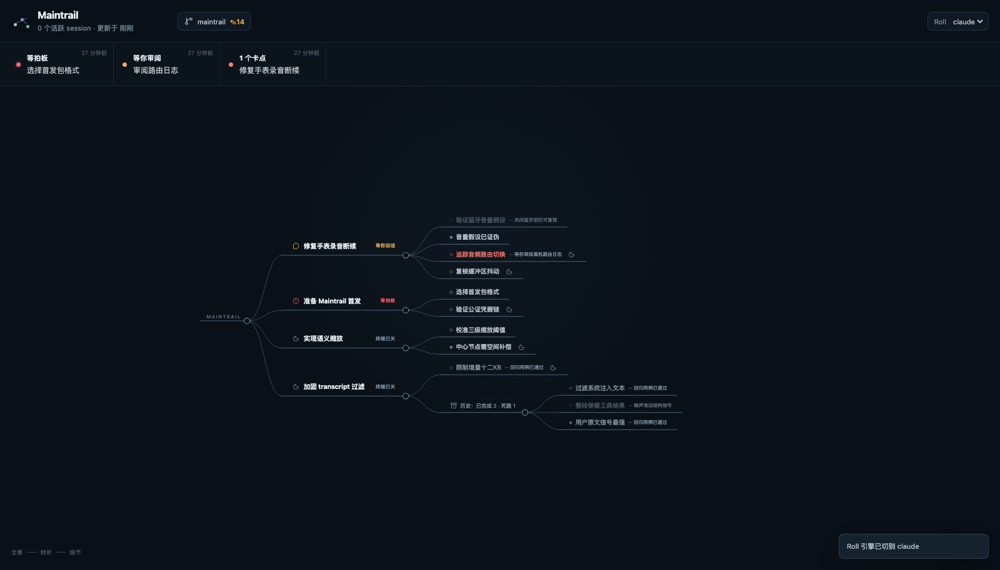

# Maintrail

**The persistent thinking map for parallel coding agents.**

Maintrail turns Claude Code and Codex transcripts into an external thinking
tree. Switch back to any line of work and see, in a few seconds, what the goal
was, which approaches died, what changed direction, and what needs you now.

It is deliberately not a session dashboard. A top-level object is a piece of
work, not a terminal or process. Sessions are read-only sources and movable
cursors: a dead session does not erase its trail, and a replacement session can
continue growing the same object.



## What makes it different

- **Thought structure, not activity tiles.** Goals, attempts, findings,
  blockers, decisions, and dead paths remain visible as a tree.
- **Semantic attachment.** The selected roll model decides whether a session
  continues an existing mainline; cwd and keyword heuristics never decide it.
- **Object permanence.** Work and session entrances fade or archive, but never
  silently disappear. A closed terminal becomes a resume action.
- **Bounded and crash-safe.** Tree and transcript offsets share one atomically
  replaced JSON file. A roll is committed at-most-once, and model input stays
  independent of total transcript length.
- **Local by construction.** No CDN, analytics, telemetry, or transcript
  writes. The server binds only to `127.0.0.1` and every API requires a private
  capability token.

## Quick start

Maintrail is macOS-first. Bun 1.3.13 or newer is required when running from
source; release binaries embed Bun and the entire web UI.

```bash
git clone https://github.com/hao-cyber/maintrail.git
cd maintrail
bun install --frozen-lockfile
bun run start
```

Open `http://127.0.0.1:4317`. Maintrail watches these append-only sources:

```text
~/.claude/projects/*/<sessionId>.jsonl
~/.codex/sessions/YYYY/MM/DD/rollout-*.jsonl
$CODEX_HOME/sessions/YYYY/MM/DD/rollout-*.jsonl
~/Library/Application Support/orca/codex-runtime-home/home/sessions/...
```

Alternate Codex homes are deduplicated by logical session identity, so an Orca
mirror cannot replay the same non-idempotent tree growth.

The default roll engine is `claude -p`. Authenticated `codex`, `kimi`, and
`grok` CLIs appear enabled in the UI selector; an installed but logged-out CLI
is shown explicitly instead of failing after selection.

## Commands

```bash
maintrail serve                 # watcher, serial roll worker, local UI
maintrail once                  # consume pending transcript increments once
maintrail install               # install and start a per-user launchd service
maintrail uninstall             # remove that launchd service
maintrail status                # summarize durable local state
maintrail demo                  # seed ~/.maintrail-demo for UI exploration
```

Use `--state-dir PATH`, `--port PORT`, `--no-open`, or `--no-watch` where
appropriate. Durable state defaults to `~/.maintrail/state.json`; the capability
token is `~/.maintrail/capability.token` with mode `0600`.

## How the pipeline stays bounded

```text
Claude / Codex append-only JSONL
        │  5 s polling · 32 KiB / 90 s linger · 45 s cooldown
        ▼
structural adapter
        │  user text + assistant text + tool/error metadata · ≤ 12 KiB
        ▼
one-shot semantic roll model
        │  existing mainlines + current subtree ≤ 120 lines · ≤ 6 ops
        ▼
single-writer runtime
        │  subtree authorization · offset-before-apply · atomic rename
        ▼
state.json ───────────────► local markmap UI
```

The model owns open semantic judgments: mainline attachment, structural turns,
and whether the agent is waiting for a decision, review, or reply. The runtime
owns IDs, schema validation, write boundaries, offsets, serialization, and every
side effect. See [the architecture contract](docs/architecture.md).

## Navigation and Orca

When Orca is installed, Maintrail matches a session's last user prompt to
`orca worktree ps`, resolves its pane and terminal handle, then switches,
resumes, or sends text through the Orca CLI. Without Orca, macOS falls back to
TTY-precise iTerm2/Terminal focus and opens Terminal for resume. It intentionally
does not inject keystrokes without Orca.

- Click a mainline or cursor row to focus/resume its best session.
- Option-click a session row to send it a message.
- Right-click a mainline to archive it; use the toast to undo.
- Double-click empty canvas or press **Fit** to restore the full view.
- Zoom out for mainlines only; pan/zoom and pause to progressively reveal the
  visible area. Manual folds always win and survive refreshes.

## Build and macOS release

```bash
bun run check                  # typecheck, browser parse, 50+ tests, compile
bun run build                  # dist/maintrail standalone executable
bun run release:mac            # signed arm64 and x64 release artifacts
```

`release:mac` auto-detects installed **Developer ID Application** and
**Developer ID Installer** identities. Override them with
`APPLE_SIGNING_IDENTITY` and `APPLE_INSTALLER_IDENTITY`. Notarization is an
explicit network action:

```bash
MAINTRAIL_NOTARIZE=1 \
MAINTRAIL_NOTARY_PROFILE=maintrail-notary \
bun run release:mac
```

The script emits separately signed arm64 and x64 zips, optional signed pkgs, and
`SHA256SUMS`. Bun publishes architecture-specific standalone targets rather
than a universal target. The script never uploads for notarization unless the
flag is present.

Developer ID builds retain the minimal JavaScriptCore JIT entitlements required
by [Bun's macOS signing guide](https://bun.com/docs/guides/runtime/codesign-macos-executable),
while library validation and DYLD environment protection remain enabled.

For a release zip, unpack the artifact and run `./maintrail install`. The
compiled executable copies itself atomically to `~/.local/bin/maintrail` before
installing the launch agent, so removing the download cannot break the service.

## Development

```bash
bun run dev
bun test
bun run typecheck
bun run check:web
```

UI assets are vendored under `web/vendor`; network-loaded runtime assets are a
bug. Regression tests cover corrupt-state repair, cross-mainline writes,
reattach boundaries, giant and partial JSONL lines, self-ingestion, hard input
caps, at-most-once crash windows, command quoting, Markdown/HTML injection,
capability auth, and Origin/media-type enforcement.

Please read [CONTRIBUTING.md](CONTRIBUTING.md) before proposing behavior changes
and report sensitive findings as described in [SECURITY.md](SECURITY.md).

MIT © 2026 Hao
